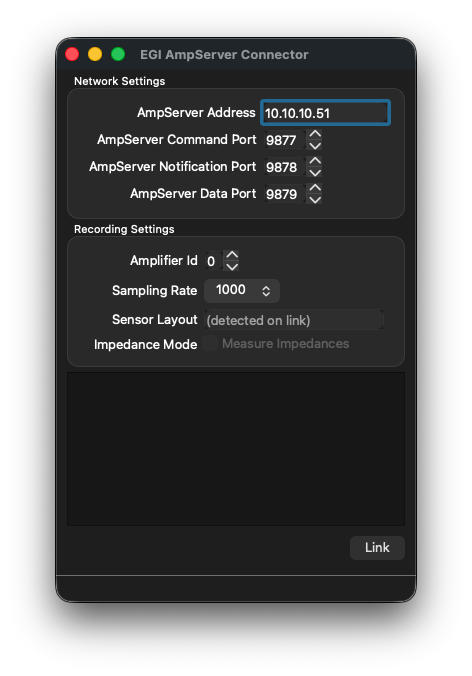

# LSL EGI AmpServer Application

## Usage

This program should work with any amplifier that works with the AmpServer produced by EGI (http://www.egi.com/).
All communication with the amplifier happens through the Amp Server Pro SDK, [documented here](https://www.egi.com/images/stories/manuals/amp-server-pro-sdk-3-0-network-apis-user-guide-rev-01.pdf).

  * Make sure that your AmpServer is running and can correctly record from its connected amplifier(s). To connect to the Amp Server you need to purchase the Amp Server Pro SDK.

  * Start the EGIAmpServer app. You should see a window like the following.
> > 

  * Make sure that you have the correct IP address of the AmpServer assigned. The ports correspond to the default settings of the server and should not require a change.

  * If you have multiple amplifiers connected to the AmpServer and you would like to record from a specific one, you need to set the correct amplifier ID (these should be increasing from zero). Also make sure that you are using a supported number of channels and a supported sampling rate (the defaults should work).

  * To link the application to the LSL, click the "Link" button. If all goes well you should now have a new stream on the network with name "EGI NetAmp k" (k corresponding to the index of the amplifier) and type "EEG". If you get an error you might try to manually power on the desired Amp and try to link while it is either recording or stopped.

  * For subsequent uses you can save the desired settings from the GUI via File / Save Configuration. If the app is frequently used with different settings you might make a shortcut on the desktop that points to the app and appends to the Target field of the shortcut the snippet `-c name_of_config.cfg` to denote the name of the config file that should be loaded at startup.

## Command-Line Interface

The CLI provides a lightweight alternative to the GUI:

```bash
./EGIAmpServerCLI [options]
```

### Options
- `--config <file>` - Load configuration from file
- `--address <addr>` - AmpServer IP address (default: 10.10.10.51)
- `--cmd-port <port>` - Command port (default: 9877)
- `--data-port <port>` - Data port (default: 9879)
- `--amp-id <id>` - Amplifier ID (default: 0)
- `--sample-rate <hz>` - Sample rate in Hz (default: 1000)
- `--impedance` - Enable impedance testing mode
- `--shutdown` - Shutdown the Amp Server (terminates all connections)
- `--help` - Show help message

### Example
```bash
# Basic usage
./EGIAmpServerCLI --address 10.10.10.51

# With impedance testing
./EGIAmpServerCLI --address 10.10.10.51 --impedance
```

## Impedance Testing

The application supports dual-stream impedance testing, allowing you to measure electrode impedances without disrupting ongoing EEG recordings.

### Overview

When impedance mode is enabled:
- The amplifier switches to impedance measurement mode (injects test signals)
- **Two LSL streams are created**:
  1. **EEG Stream** (`type: EEG`) - Continues with raw data at the configured sample rate (contains test signals during impedance testing)
  2. **Impedance Stream** (`type: Impedance`) - Publishes compliance voltage values when current injection is active

This dual-stream approach ensures downstream applications recording EEG data are not disrupted by impedance measurements.

### Enabling Impedance Mode

#### Via CLI
```bash
./EGIAmpServerCLI --address 10.10.10.51 --impedance
```

#### Via Configuration File
Add to your `ampserver_config.cfg`:
```xml
<settings>
  <impedance>true</impedance>
  <!-- other settings -->
</settings>
```

#### Via GUI
Currently not implemented in GUI. Use CLI or config file.

### LSL Streams Created

#### 1. EEG Stream
- **Name**: `EGI NetAmp <amp_id>`
- **Type**: `EEG`
- **Rate**: Configured sample rate (e.g., 1000 Hz)
- **Channels**: Depends on sensor net (32-256 channels)
- **Unit**: microvolts
- **Behavior**: Streams continuously with raw amplifier data (includes test signals during impedance mode)

#### 2. Impedance Stream
- **Name**: `EGI NetAmp <amp_id> Impedance`
- **Type**: `Impedance`
- **Rate**: 0 (irregular rate - only when current is injecting)
- **Channels**: Same count and labels as EEG stream
- **Unit**: volts (compliance voltage)
- **Behavior**: Only publishes samples when the amplifier's TR byte indicates current injection is active

### Understanding the Data

#### Compliance Voltage
The impedance stream provides **compliance voltage** measurements in volts:
- Formula: `V_compliance = (V_channel + V_ref) × 201 × 10⁻⁶`
- This represents the voltage required to maintain constant current through the electrode-skin interface

#### Converting to Impedance (Ohms)
Once you confirm the drive current with EGI:
```
Z (Ω) = V_compliance (V) / I_drive (A)
```

**Example**: If EGI confirms a 10 nA drive current:
```
Z (Ω) = V_compliance (V) / 10×10⁻⁹ (A)
Z (kΩ) = V_compliance (V) / 10×10⁻⁶ (A)
```

#### TR Byte
The impedance stream monitors the TR (test/reference) byte from the amplifier:
- **Bit 2 cleared (TR & 0x04 == 0)**: Current injection ON → impedance samples published
- **Bit 2 set (TR & 0x04 == 1)**: Normal mode → no impedance samples

This means the impedance stream will have gaps when current injection is not active.

### Testing with Mock Server

The mock server supports impedance mode for development testing:

**Terminal 1: Start mock server in impedance mode**
```bash
python3 mock/mock_ampserver.py --impedance
```

**Terminal 2: Run CLI with impedance mode**
```bash
./EGIAmpServerCLI --address 127.0.0.1 --impedance
```

The mock server generates deterministic impedance data for verification:
- Base count: 10,000
- Step size: 250 per channel group
- TR byte: 0xFB (bit 2 cleared = injecting)
- Reference monitor: 10,000

### Hardware Commands Sent

When impedance mode is enabled, the following commands are sent to the amplifier:
1. `cmd_TurnAll10KOhms` (1) - Place 10kΩ resistor on all channel inputs
2. `cmd_SetReference10KOhms` (1) - Place 10kΩ resistor on reference input
3. `cmd_SetSubjectGround` (1) - Configure subject ground
4. `cmd_SetCurrentSource` (1) - Enable constant current mode
5. `cmd_TurnAllDriveSignals` (1) - Enable drive signals on all channels

### Limitations and Notes

- **No real-time impedance in Net Station**: If you start Net Station Acquisition after enabling impedance mode, Net Station will not display impedance values (it expects the amplifier to be in default mode)
- **Stream metadata**: The impedance stream includes a note in its metadata: "Compliance voltage values. Divide by drive current to obtain impedance in ohms."
- **Sample rate**: The impedance stream uses rate=0 (irregular) to indicate samples arrive on-demand
- **Channel labels**: Both streams use identical channel labels (E1, E2, ..., En)

### Downstream Processing

Example Python code to process impedance data:
```python
import pylsl

# Resolve both streams
streams = pylsl.resolve_byprop('type', 'EEG')
impedance_streams = pylsl.resolve_byprop('type', 'Impedance')

# Create inlets
eeg_inlet = pylsl.StreamInlet(streams[0])
imp_inlet = pylsl.StreamInlet(impedance_streams[0])

# Pull impedance data (will return empty if not injecting)
imp_sample, timestamp = imp_inlet.pull_sample(timeout=0.0)
if imp_sample:
    # Convert to ohms (example with 10 nA drive current)
    drive_current_A = 10e-9
    impedances_ohms = [v / drive_current_A for v in imp_sample]
    impedances_kohms = [z / 1000 for z in impedances_ohms]
    print(f"Impedances: {impedances_kohms} kΩ")

# EEG data continues normally
eeg_sample, timestamp = eeg_inlet.pull_sample()
```

# Acknowledgements
This application was written to behave near-identically to the BCI2000 AmpServer module that was originally created by EGI.

# Optional

The configuration settings can be saved to a .cfg file (see File / Save Configuration) and
subsequently loaded from such a file (via File / Load Configuration).

Importantly, the program can be started with a command-line argument of the form
`EGIAmpServer.exe myconfig.cfg`, which allows to load the config automatically at start-up.
The recommended procedure to use the app in production experiments is to make a shortcut on
the experimenter's desktop which points to a previously saved configuration customized to the
study being recorded to minimize the chance of operator error.

# Mock Server for development

To use the mock server for development:

**Terminal 1: Start mock server**

> python3 mock/mock_ampserver.py

**Terminal 2: Run CLI or GUI against localhost**
> ./cli/EGIAmpServerCLI --address 127.0.0.1
> # or update ampserver_config.cfg to use 127.0.0.1 and run GUI

The mock server generates synthetic sine waves (10-50 Hz) with noise for the EEG data, so you can also verify the LSL stream in downstream applications.

# Known Issues

## Net Station Acquisition Compatibility

When the user 

### Behavior When EGIAmpServer is Streaming First

The following table documents how EGIAmpServer behaves when it is already connected and streaming, and Net Station Acquisition (NAS) subsequently interacts with the amplifier:

| NAS Action | EGIAmpServer Behavior | Stream Status |
|------------|----------------------|---------------|
| NAS launches and scans for devices | No change detected | Continues |
| NAS clicks "On" (connect) | No change (amp already running) | Continues |
| NAS starts recording | No change detected | Continues |
| NAS stops recording | No change detected | Continues |
| NAS clicks "Off" (disconnect) | `ERROR: The stream was lost` - stream terminates | **Stopped** |
| NAS closes | No additional change | Already stopped |

**Key finding**: NAS powering off the amplifier terminates the EGIAmpServer data stream. The CLI process remains running but stops streaming data.

### Amplifier Shutdown (Severe)

NAS has an "Amplifier Shutdown" button that is more severe than simply clicking "Off". When triggered while EGIAmpServer is streaming:

| Test | Result |
|------|--------|
| EGIAmpServer stream | `ERROR: The stream was lost` - terminates |
| Ping amplifier (10.10.10.51) | **FAILED** - 100% packet loss |
| TCP connect to AmpServer | Succeeded (AmpServer software still running) |
| Query amplifier details | **FAILED** - `Failed to get amplifier details` |
| Start new stream | **FAILED** |

**Recovery**: The amplifier requires a power cycle to recover from this state. The AmpServer software remains accessible but cannot communicate with the shutdown amplifier hardware.

### Recommended Workflow

When using this application alongside Net Station Acquisition:

- **Start Net Station first**: If you plan to use Net Station Acquisition, start it and initialize the amplifier (click "On") BEFORE connecting this app. Our app will detect the running amplifier and automatically use its sample rate.

- **Do not start Net Station after**: If this app is already streaming and Net Station subsequently initializes the amplifier at a different sample rate, our app cannot detect this change. AmpServer only sends notifications to one subscriber, and Net Station consumes them when it's running.

- **Recommended workflow**:
  1. Start Net Station Acquisition
  2. Initialize the amplifier at your desired sample rate (click "On")
  3. Start EGIAmpServer and click "Link" - it will detect the running amp and match its sample rate
  4. Both applications will now receive data at the correct rate

## Dropped Packets After Device Shutdown

After Net Station shuts down the amplifier (via "Shutdown" command), immediately starting this app may result in excessive dropped packets and eventual stream loss. This appears to be related to stale data in the connection. **Workaround**: Wait a moment and restart the app, or power cycle the amplifier.

## Sample Rate Auto-Detection

The app automatically detects the sample rate when connecting to an already-running amplifier by measuring packet timing. This detection snaps to standard rates (250, 500, or 1000 Hz). If the amplifier is idle when connecting, the app uses the sample rate configured in the UI/config file.
